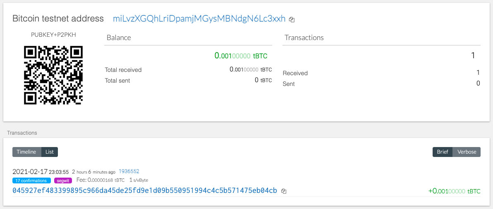
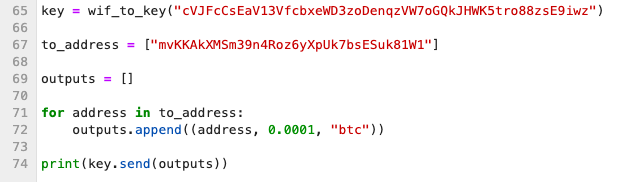
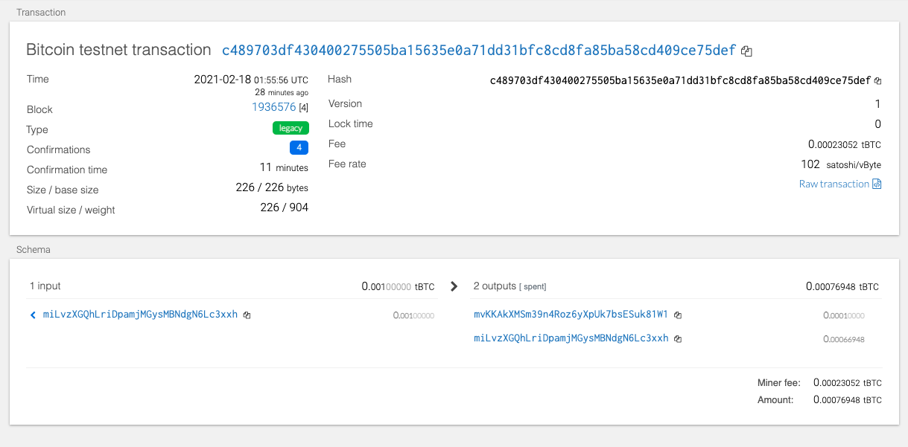

#Python Wallet

This wallet is built completely on Python as opposed to using a customary, pre-fab interface.
It allows the owner to trade multiple kinds of cryptocurrency (ETH, and BTCTEST, respectively) from one location, rather than having to keep track of multiple wallets with multiple keys.

##Setup
* In order to set this wallet up, one must install hd-wallet-derive from php.

* Assuming the user already has PHP installed, run the following lines in you CLI terminal:

	git clone https://github.com/dan-da/hd-wallet-derive
	cd hd-wallet-derive
	curl https://getcomposer.org/installer -o installer.php
	php installer.php
	php composer.phar install

* You must also import Web3 and bit onto your computer in order to leverage your wallet. Both are simple pip installs.

* You are now ready to use your wallet!

##Your Python Wallet in Action!

###Making a transaction on the Bitcoin Testnet:
First, you have to fund one of your addresses with a Testnet faucet:

Next, simply enter the necessary private key of your newly funded address, and the destination address you want to send it to.

Voila! You've just sent a complete transaction!

###Making a transaction on Ethereum:

